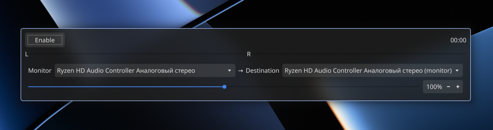

# pw-looper



Little Qt6 util for graphical managing of pipewire loopback module

Tired of asking your friend on the other end: "how's my mic?"?
Then use this tool! It loops back your microphone input to your headphones with almost zero latency.
Scared that your own voice will interrupt you? Have no fear — 99% of the time that was a problem of high latency, which this app doesn't have!
You'll get used to it in a few minutes, and won't be able to go back!

> Made on vibes.

## Drawbacks

- Format is hardcoded to F32 / stereo / 48 kHz — PipeWire adapters
  resample and channel-mix transparently.
- Single instance only. No auto-start, no multiple concurrent loopbacks.
- Ringbuffer full → quantum dropped; only happens if playback stalls.

## Build

### Nix (preferred)
```sh
nix build              # produces result/bin/pw-looper
nix develop            # dev shell: cmake, qt6, pipewire, clang-tools
```

### Shell (with deps installed)
```sh
cmake -B build -G Ninja -DCMAKE_BUILD_TYPE=Release
cmake --build build
./build/pw-looper
```

## Tests
```sh
./build/test_loopback_enable   # enable/disable with real PipeWire streams
/tmp/test_ring                 # SPSC ringbuffer handoff (see tests/test_ring.cpp)
```

## Development
```sh
clang-format -i src/*.cpp src/*.hpp tests/*.cpp
clang-tidy -p build src/main.cpp src/pipewire_engine.cpp src/main_window.cpp
```